## Infrastructure-as-python: Getting started with Pulumi and AWS

This tutorial series will teach you how to use Pulumi, a free and open source software development kit that lets you use full-fledged programming languages to create, deploy, and manage infrastructure on major cloud platforms. For this tutorial series we will be specifically focusing on python as our programming language and Amazon Web Services (AWS) as our cloud provider.

### Prerequisites

This tutorial assumes you have:

* Python 3.6 or later
* Pulumi installed
* an AWS account (if you do not have one click [here](https://aws.amazon.com/premiumsupport/knowledge-center/create-and-activate-aws-account/))
* Basic knowledge of AWS core services (you know that S3 is object storage, EC2 is where you can create virtual machines etc...)
* AWS CLI installed (if you do not click [here](https://docs.aws.amazon.com/cli/latest/userguide/install-cliv2.html))
* the ability to run bash commands (so if you're using Mac or Linux you can just open a terminal window. If you are using Windows, you can use an IDE like Visual Studio Code that has a built-in terminal or install a program like Cygwin)

### Background: What is infrastructure-as-code?

With the rise in popularity of DevOps you might have heard the term **infrastructure-as-code** before. But what does it mean? Put simply, it means being able to provision and manage infrastructure automatically through the use of code as oppposed to manually making changes to your systems. Managing your infrastructure like it's your application code means it will also be versioned, documented, and logged (well hopefully). It also means you'll have a standardized way of setting up your infrastructure which makes it easier to both deploy it or roll back any changes should something go wrong.

### What is Pulumi?

Pulumi came along in 2017 so it is a relative newcomer as far as infrastructure-as-code tools go. However, where it shines is that it lets you use your favorite turing-complete programming language to create, deploy, and manage your infrastructure as opposed to using a YAML or JSON file (Cloudformation) or a domain-specific language (Terraform). Being able to use a language as powerful as python where you are already familliar with the constructs and have an existing ecosystem in is a really big advantage. In addition, Pulumi is cloud-agnostic so it works with all of the three major cloud providers - AWS, Azure, and Google Cloud. All of these things combined make Pulumi a really powerful tool worth learning in 2020!

### What will we do in this tutorial?

We will start off by creating a new user in our AWS account and give that user access to the S3 and KMS services. We will use Pulumi to create an S3 bucket and a KMS key to encrypt that bucket. This will get you started with Pulumi in a hands-on way and in later tutorials we can deep dive into more advanced topics. 

### Creating an AWS user

We are going to start this tutorial by creating an IAM user since we never want to do work in our root account. Our root account has virtually unrestricted access to all of the AWS services and someone working in the root account has the potential to cause some serious damage if they're not careful enough. If you already have a user in your account that you would like to use, you can skip this section. Just make sure they have the permissions described below.

Currently, you should be logged into your console as the root user.

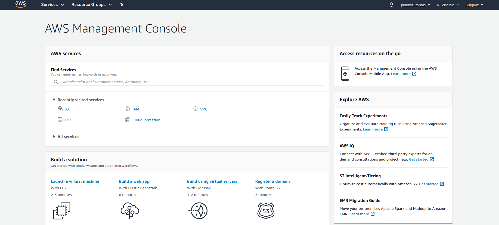

Go to "Services" in the upper left-hand corner. We are going to type in IAM (dentity & Access Management). 

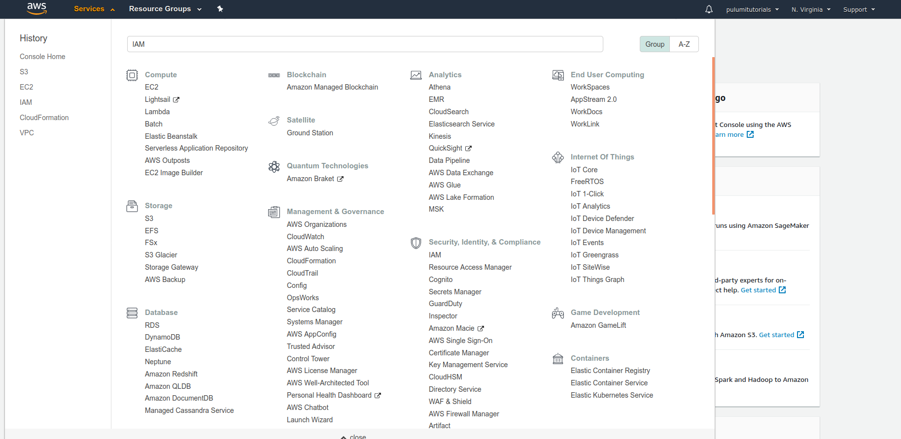

Next, we will click on "Users" and then "Add User".

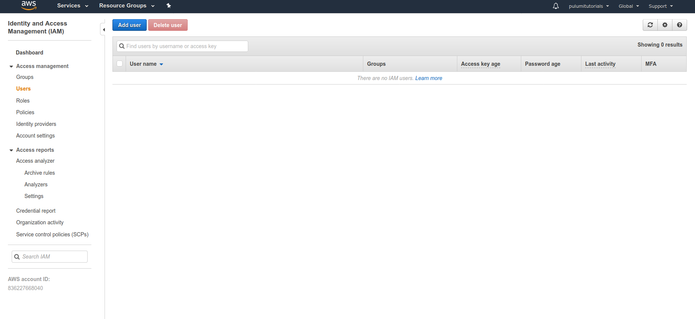

We will give our user a name and then give our user both programmatic and console access since we will be using this same user in future tutorials. We will also go ahead and create a password for our user.

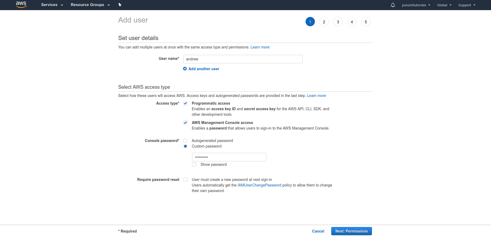

We will then attach an existing policy directly to our user. For best practices, it would be better to create a group for the user, attach a policy to that group, and then add that user to the group. This would make it much easier to manage policies as the number of users goes up but we're only using this account for demo purposes and we don't intend on making anymore users so this is fine.

The policy we are attaching is called "AmazonS3FullAccess". This gives our user full access to the S3  service. We could give this user full administrator access and not worry about attaching other policies, but that poses many security risks since people should only have access to what they need. This is an important security concept known as "least privelege", which means we only want to authorize users for access they need so they can't unintentionally delete/change something they don't need access to.  

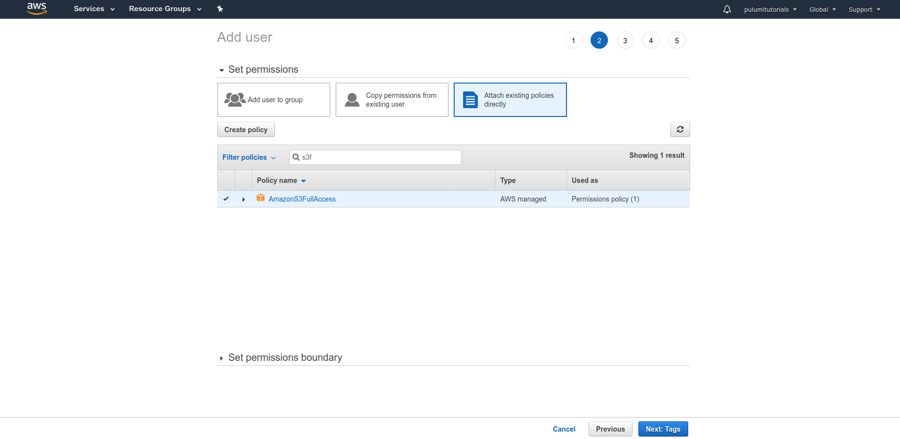

We will then click through "Next" and create our user. 

Now you will see a screen that shows your Access key ID and your Secret access key. Click the "Download .csv" button to save these credentials to your computer. The Access key ID is a public ID and the secret access key is a private key that only you should know. You will need these to sign-in to the AWS console. 

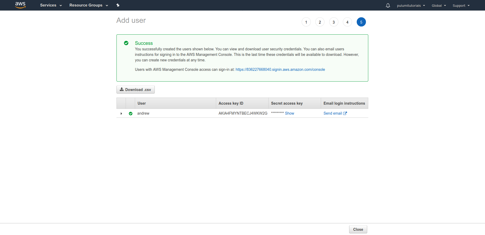

You should see your user in the Users page. 

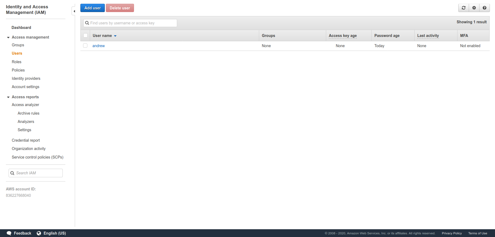

Lastly, we will create a policy to give our user full access to the KMS. Click on the user and then click on "Add permissions" again and go to "Attach existing policies directly". Click "create policy". For service type in "KMS". For actions make sure that "All KMS actions" is checked. This will let our user use all actions (read, write etc...) for the KMS service. Then select "All resources" to let our user have these permissions for all KMS resources. 

Click on "Review Policy" and then create the policy.

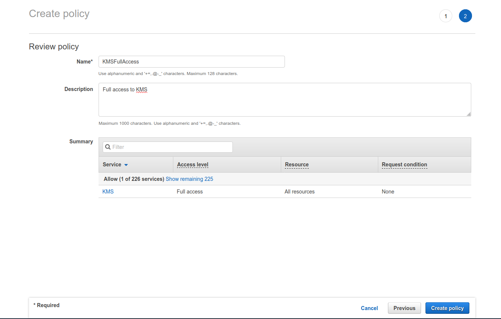

Our user should have the following policies:

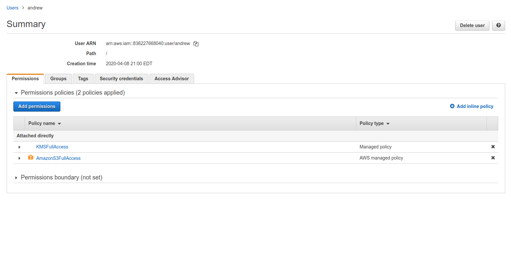

### Setting up AWS Command Line Interface

If you are using Mac or Linux, open up a new terminal window. If you are using Windows you can use an IDE like Visual Studio Code that has bash terminal capabilities built-in or you can install a program like [Cygwin](https://cygwin.com/install.html).  

Type in `aws --version` to make sure you have AWS CLI installed. We might as well make sure we have Pulumi installed as well. To do that type in `pulumi version`.

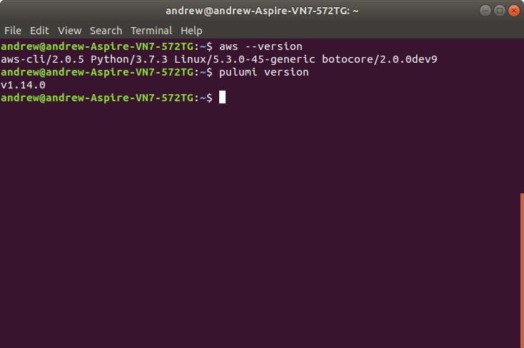

Now we will configure the user we just made to have programmatic access to the account. We will do that by typing in `aws configure`. We see it prompts us for our Access Key ID. Open the "credentials.csv" file we saved earlier and paste in the access key ID. Hit "enter" and do the same for the Secret Access Key. Hit enter again and enter the region you would like to create your server in. Let's choose `us-east-1`. Type that in and hit enter again. For the default output format type in `json`. And now we're done. I will not be showing a picture of this step because it contains my secret access key. 

To see if it worked, type in `aws s3 ls`. This command lists our S3 buckets. We should see no buckets come up since we haven't made anything yet, but we also shouldn't see any errors if we configured our account properly. 

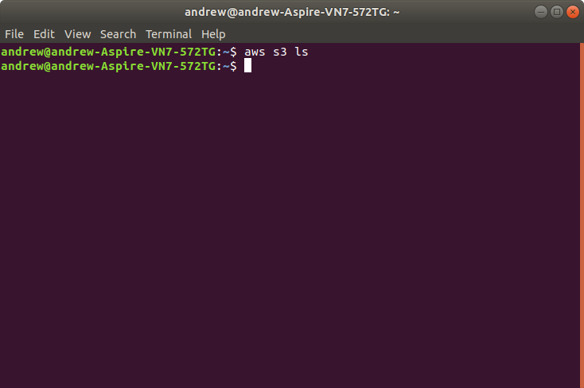

### Creating a new Pulumi project

Let's make a new directory for this project and go into it. Type in `mkdir <folder-name> && cd <folder-name>`. I decided to name my folder pulumistart.

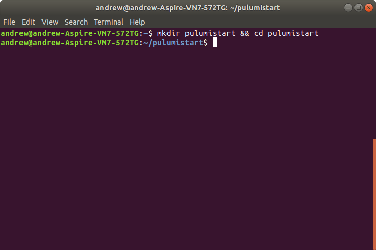

Now type in `pulumi new aws-python`. This will start a new project for you and since it is your first time using Pulumi it will ask you to login to their service. If you hit enter it will open up the login page in your default browser and you can login from there. 

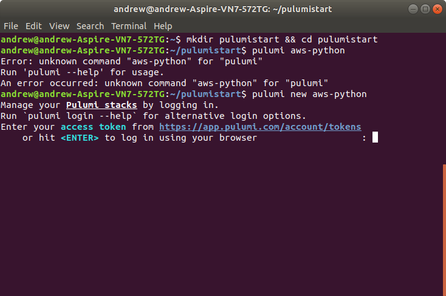

After logging in, Pulumi will ask you for a project name, description, and stack name. You can leave them as the default choices by hitting "Enter" or you can change them. We will also go over what these mean after we're done setting things up.

Next it will prompt you for a region. Choose the region that you would like to make your resources in (the same region you entered when you were configuring AWS CLI access). 

### Reviewing the new project

Now let's do an `ls` command to see what all of that just did. We see that there are now some files in our directory. 

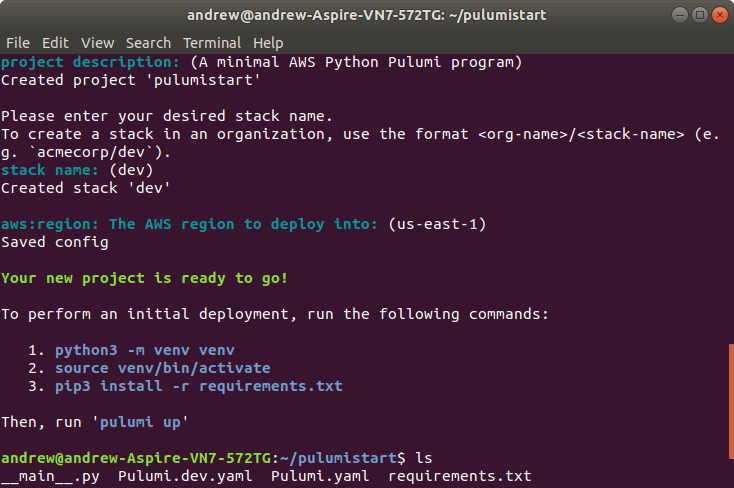

Let's take a look at the __main.py__ file. You can open it in the IDE or text editor of your choice. I am going to use VIM so I will type in `vim __main__.py'. 

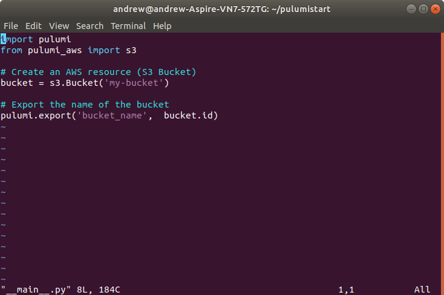

We see that this script imports the pulumi package and imports the s3 module from the pulumi_aws package. 

The next line of code creates an object called `bucket` and calls it "my-bucket".

The line of code after that exports the name of the bucket as an output that we will see later after we create the bucket. Exporting this variable lets us know which resource we just made so we can look for it using it's name.  

Now let's exit out of there and take a look at the "Pulumi.yaml" file by typing in `vim Pulumi.yaml`.

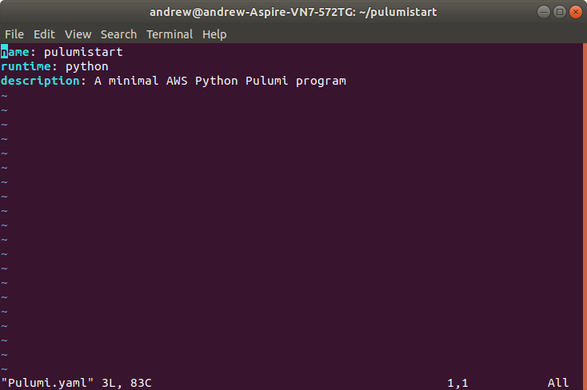

We can see that this file  defines our project. It contains the name of the project, the runtime (in our case python), and the description we entered earlier. Let's exit that file and take a look at the other two files.

Next we will look at the Pulumi.dev.yaml file by typing in `vim Pulumi.dev.yaml`. 

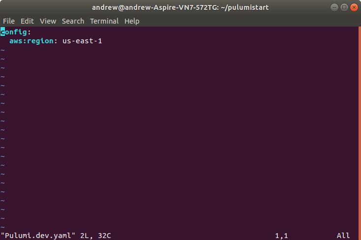

We can see that this file contains the configurations for the stack we entered earlier, which in this case, is just the region. Let's exit out of there and take a look at the last file.

The last file is a requirements file which we can open by typing in `vim requirements.txt`. 

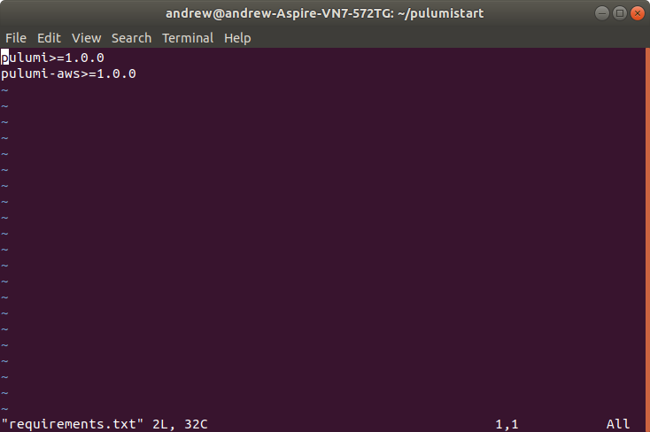

This file is extremely useful because it holds our package dependencies. When we create our virtual environment we will be able to install these packages with a command to be shown later and that becomes extremely useful when we are trying to dsitribute code to people. That enables the person receiving the code to be able to use the same packages that we used and we know work properly.

Speaking of virtual environments, let's go ahead and create a virtual environment. I am going to name mine "venv" and type in `python3 -m venv venv`.

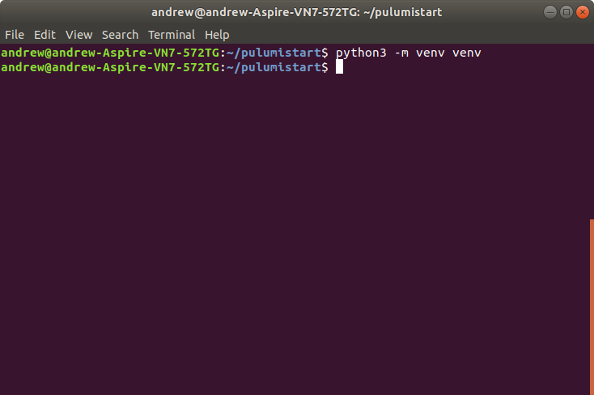

We have to activate the virtual environment by typing in `source venv/bin/activate`. Now we should see that we're in our virtual environment.

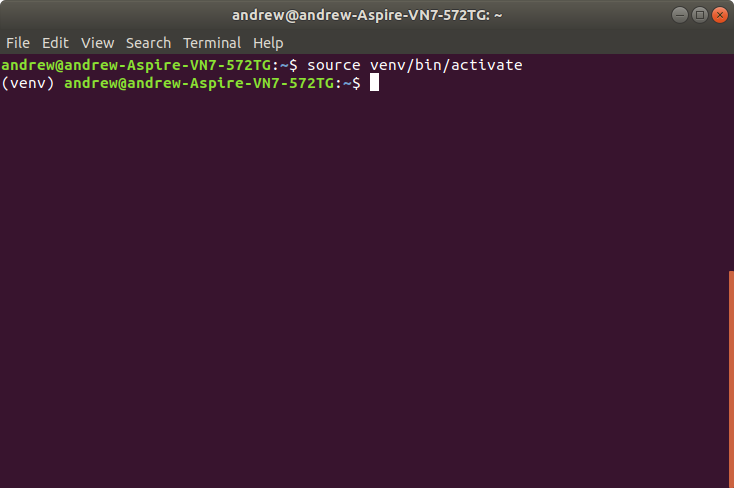

For the last part here, we will install our dependencies we defined in the "requirements.txt" file as I mentioned before. We will type in `pip3 install -r requirements.txt`. This command will take a few minutes to run.

### Deploying our stack

It's time to deploy our stack. So what is a stack and what is the difference between a stack and a project? A stack is a piece of code that has it's own configuration. A project is a single place to store that code. A project can have multiple stacks which means it can have multiple pieces of code that accomplish different things and have their own configurations. For example, one way to split a project is into environments like dev/test/prod, where we have one stack that configures our development environment, a different stack that configures out test environment, and a different stack that configures our production environment. 

Now let's deploy the stack by typing in `pulumi up`. 

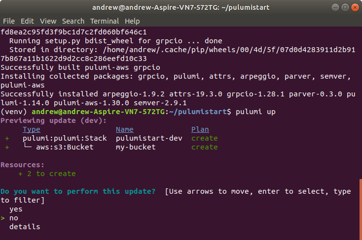

What does this message tell us? It tells us that it's creating 2 objects: a pulumi stack that we named ourselves and an S3 bucket named "my-bucket". Let's press "yes" to perform this update. 

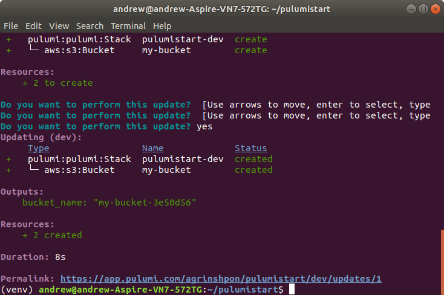

Now we should see that Pulumi created our 2 resources and the name of the bucket will be displayed there. You may be wondering why your bucket is not actually named "my-bucket". It is because S3 bucket names are globally unique which means that no two buckets can have the same name. Pulumi appended a random string value to that bucket in order to create it. 

Now let's check if we can see that bucket by doing an `aws s3 ls` command. If everything worked properly, you should be able to see that bucket. 

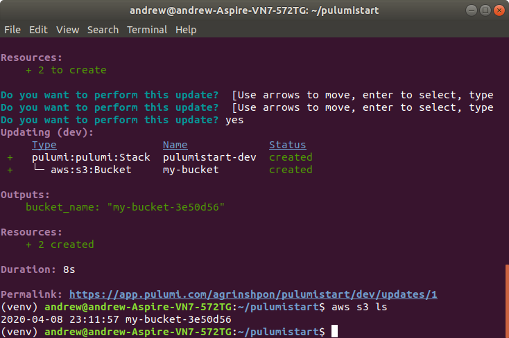

### Updating our stack

We're going to update our stack to add server-side encryption to our bucket. Let's update our "__main__.py" file with the code below:

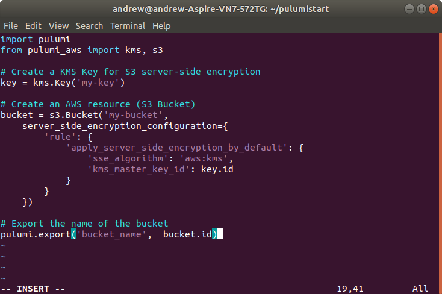

Now you'll see that we imported the kms module from the `pulumi_aws` package. We will use this module to generate an encryption key to encrypt the data in our bucket which is the `key` variable we created. You can also see that we now have another parameter called `server_side_encryption_configuration` which is a nested dictionary that defines how we will encrypt our bucket. Note that we call the id of the key in this nested dictionary when we are configuring the encryption. 

Let's update our stack by running another `pulumi up` command. 

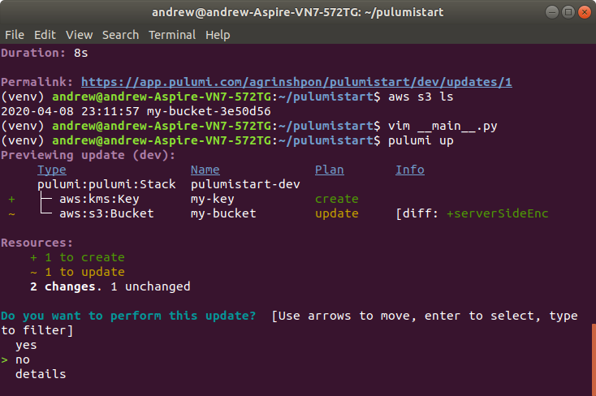

It is telling us that we have one resource to create, which is the KMS key, and one resource to update, which is the s3 bucket. Click "yes" and make the changes.

Let's see if it worked. Type in `aws s3api get-bucket-encryption --bucket <your-bucket-name>` to check the server-side encryption. If it worked, you should see a result like below:

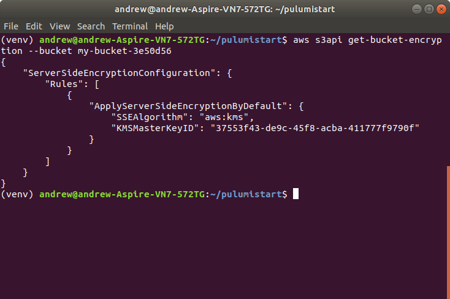

### Destroying our stack

Now it's time to destroy the stack. This is the end of the tutorial and we don't want to leave any unused items up and running because they can incur charges. Let's use the `pulumi destroy` command to do that and click "yes". Now we have deleted the S3 bucket and the KMS key and cleaned up our environment.

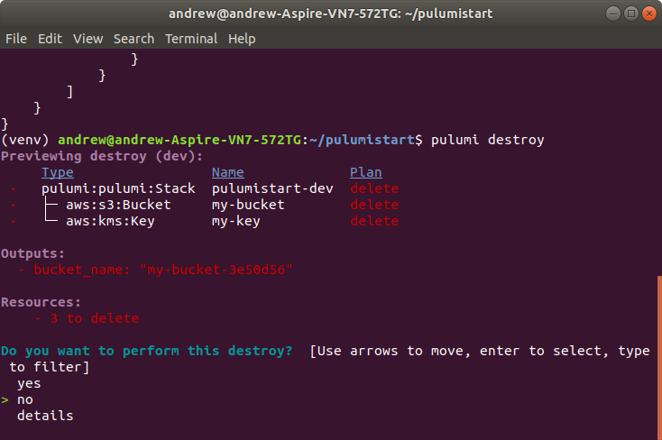

Note that your Pulumi stack still exists so you can recreate that infrastructure again any time you would like to!

### Closing Thoughts

Let's recap what we just did. We created and S3 bucket and a KMS key to encrypt that bucket in a reusable code template. We were then able to destroy both of those resources and clean up our environment. Now just think that we can create stacks to deploy entire application architectures in a standardized way. This tutorial only scratched the surface of what we can accomlpish with it as we will see how to build out entire infrastructure stacks with compute, and networking resources as well. 

